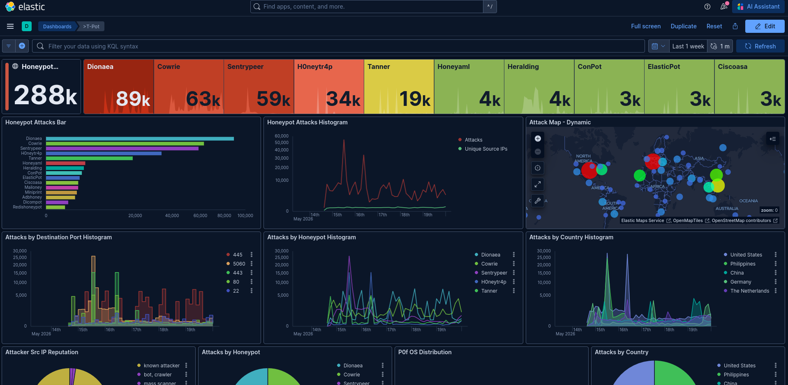

# Honeypot para una PYME turística de Lanzarote

Proyecto de fin de ciclo — **C.F.G.S. Administración de Sistemas Informáticos en Red (ASIR)**,
CIFP Zonzamas, Lanzarote. Curso 2025–2026.

Un honeypot multi-servicio sobre [T-Pot](https://github.com/telekom-security/tpotce) que simula la
infraestructura de un alojamiento turístico pequeño, expuesto a Internet durante siete semanas sin
publicidad ni indexación. La pregunta era concreta: **qué ataques recibe de verdad una PYME
turística**, no cuáles suponemos que recibe.

Análisis completo: **[Qué recibe realmente una PYME turística expuesta a Internet](https://fraydgarcia.github.io/research/que-recibe-realmente-una-pyme-turistica/)**.

## Resultados

| Medida | Valor |
|---|---|
| Hasta el primer ataque | menos de 60 minutos; casi 200 intentos en esa primera hora |
| Primeras 24 horas | 417 ataques |
| Primeras 48 horas | ~33.000 eventos, sobre todo fuerza bruta SSH y sondeo multi-protocolo |
| Una semana, dos meses después | ~288.000 eventos |
| Puertos más atacados en esa semana | 445 (SMB), 5060 (SIP), 443, 80, 22 |



Tres lecturas que salen de los datos:

1. **El ataque es indiscriminado.** Nada de ese tráfico iba dirigido a un hotel. Iba a cualquier
   cosa que respondiera, y por eso llega.
2. **La mezcla cambia con el tiempo de exposición.** Las primeras 48 horas son SSH. A escala de
   semana pasan al frente la captura de malware sobre SMB y el fraude telefónico sobre SIP.
3. **La centralita es el punto ciego.** Sentrypeer, que simula una centralita SIP, registró ~59.000
   eventos en una semana, casi todos intentos de `REGISTER` con agentes de usuario que imitan
   teléfonos reales. En un alojamiento, la centralita la instala el proveedor de telefonía y no
   entra en ningún inventario de TI.

## Montaje

| Capa | Tecnología |
|---|---|
| Plataforma | T-Pot 24.04.1 sobre Ubuntu Server, en Oracle Cloud Free Tier |
| Contenedores | Docker |
| Honeypots | Cowrie (SSH/Telnet), Dionaea (malware/SMB), Sentrypeer (SIP), H0neytr4p, Tanner (HTTP), Mailoney (SMTP), ConPot (ICS), Ciscoasa, entre otros |
| Detección de red | Suricata |
| Análisis | Elasticsearch, Logstash y Kibana |
| Marco de referencia | MITRE ATT&CK |

Un dominio señuelo, registrado a nombre de un alojamiento ficticio, hacía coherente la superficie:
quien resolvía el nombre encontraba algo que parecía un hotel pequeño.

## Contenido del repositorio

```text
memoria/        Memoria del proyecto (37 páginas)
presentacion/   Presentación de la defensa y QR de acceso
folletos/       Material divulgativo para alojamientos
docs/img/       Capturas del sistema en operación
```

Parte del proyecto fue traducir los hallazgos a algo útil para quien no es técnico:

- **[Guía práctica de ciberdefensa para su alojamiento](folletos/Guia-Practica-de-Ciberdefensa-para-su-Alojamiento.pdf)**: medidas concretas, priorizadas por impacto y coste.
- **[Diccionario de ciberseguridad para hoteles](folletos/El-Diccionario-de-Ciberseguridad-para-Hoteles.pdf)**: el vocabulario mínimo para entender a un proveedor de seguridad.

## Notas

- **Entorno.** La organización objetivo, «Apartamentos Turísticos Playa Dorada» (Puerto del Carmen),
  es un caso de estudio construido para el ciclo, no un cliente. Los ataques sí son reales: el
  honeypot estuvo expuesto a Internet.
- **Scripts.** Los scripts de extracción de datos no se publican porque contienen parámetros de
  conexión de la instancia.
- **Atribución.** Los países de origen indican desde dónde sale el tráfico, no quién ataca. El
  proyecto excluye la atribución de su alcance.
- **Seguridad.** Un honeypot expuesto a Internet solo debe desplegarse en infraestructura aislada y
  bajo control.

---

**Frainel Tomás de León García** (Fray García) · [fraydgarcia.github.io](https://fraydgarcia.github.io/) · Mayo de 2026
